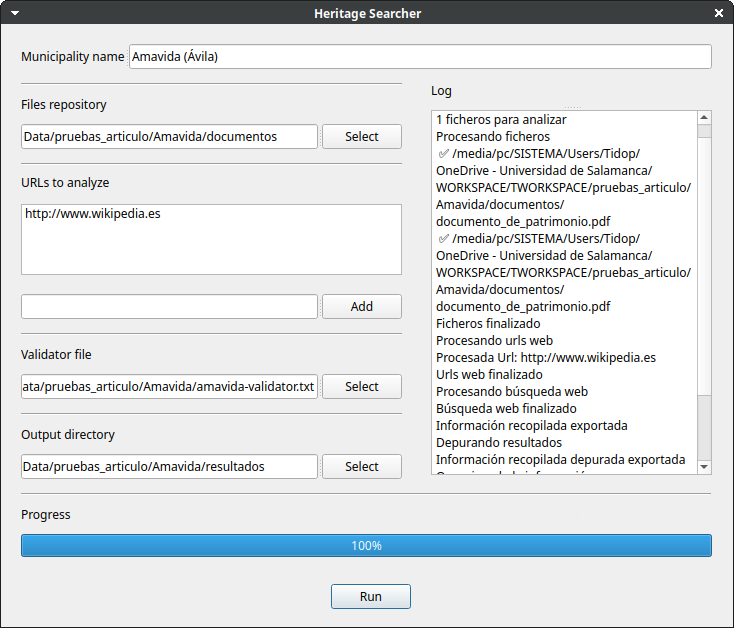

# TERRITAGE-DATA – Open Data Repository

## Overview

This repository contains datasets, software, digital resources and supplementary materials developed within the research project:

**Digital Technology and Territorial Heritage: A holistic approach for the valorization of demographically depressed rural areas (TERRITAGE-DATA)**

**Grant Reference**: CNS2023-144126

**Principal Investigator**: Miguel Ángel Maté González

The project focuses on the development of innovative methodologies based on Geomatics, Geographic Information Systems (GIS), Artificial Intelligence (AI), 3D digitization and Digital Twins for the documentation, analysis, monitoring and valorisation of territorial cultural heritage, particularly in rural areas affected by depopulation.

https://territagedata.usal.es/

## Repository Content

This repository contains Heritage Searcher, a Python application designed to support the identification, documentation and characterization of cultural heritage assets through Artificial Intelligence.

The application automates the collection and processing of information from heterogeneous sources, including websites, online repositories and local documents (PDF, TXT). Using a multi-agent architecture based on Large Language Models (LLMs), the system extracts, cleans, classifies and validates heritage information, generating structured outputs that can be used to build or update territorial heritage inventories.

## Main Features

- Automatic collection of information from websites and local documents.
- Multi-agent AI architecture for information processing.
- Semantic extraction of tangible and intangible cultural heritage.
- Automatic classification of heritage assets.
- Comparison with expert-validated inventories.
- Generation of structured documentation files.
- Modular and scalable architecture.
- Support for different data sources and document formats.
- Significant reduction in the time required for heritage inventories.

## Workflow

The application follows five main stages:

1. Define the municipality or study area.
2. Select information sources (local files and/or websites).
3. Automatically retrieve and process the available information.
4. Classify and organize heritage assets using AI.
5. Compare the generated inventory with expert validation files and produce the final reports.

## Output Files

The application automatically generates:

- Raw information file.
- Cleaned and synthesized information.
- Classified heritage inventory.
- Comparison report against expert reference inventories.

## Contributors

The development of this repository involved:

Miguel Ángel Maté-González 
Jesús Rodríguez-Hernández  
Daniel Herranz Herranz
Marta Pagán Martínez
Cristina Sáez Blázquez 
Fernando Peral Fernández
Diego González Aguilera

## Funding

This work was developed within the research project:

Digital Technology and Territorial Heritage: A holistic approach for the valorization of demographically depressed rural areas (TERRITAGE-DATA) (CNS2023-144126)

Funded by the Spanish Ministry of Science, Innovation and Universities through the State Research Agency (AEI), co-funded by the European Union – NextGenerationEU/PRTR, under the Consolidación Investigadora 2023 programme (Grant CNS2023-144126).